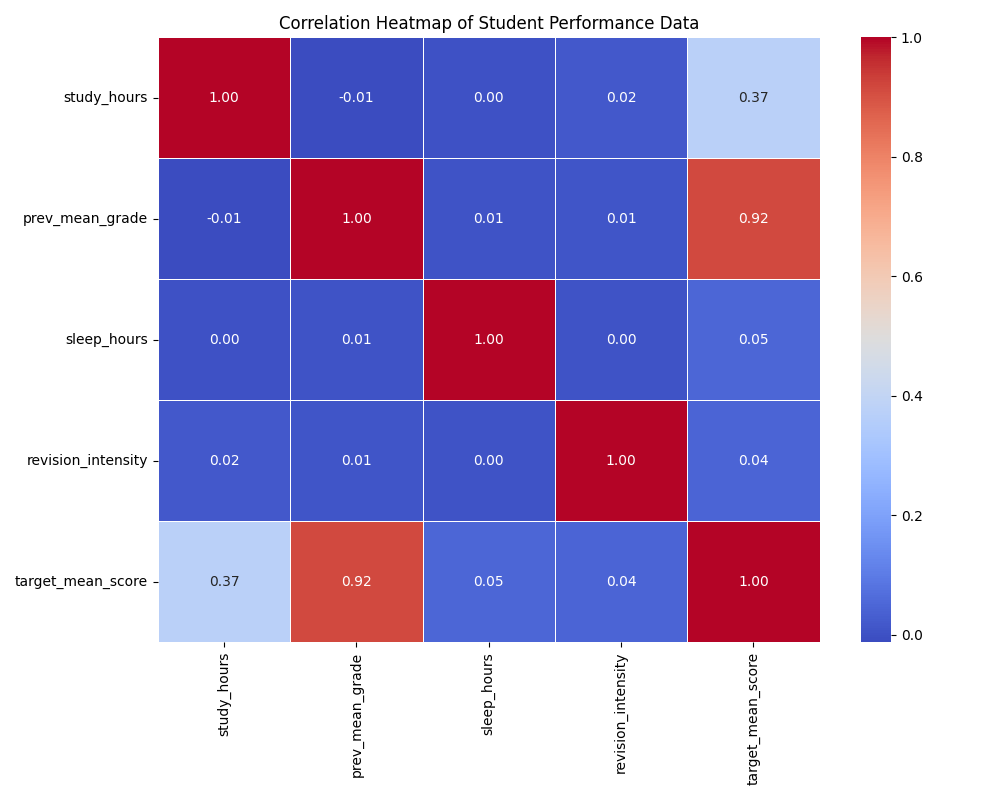

# Student Academic Performance Forecasting

### Predictive Analytics Engine — Maseno University Final Year CS Project

A full-stack system for predicting student final percentage scores using **Multiple Linear Regression (OLS)**. The engine accepts four proposal-defined features — attendance rate, CAT score, previous mean grade, and HELB funding status — and outputs a predicted final score alongside an XAI-powered risk classification (High Risk / Moderate Risk / Safe) with feature-level contribution breakdowns.

The project ships a complete pipeline: synthetic data generation, model training with 5-fold cross-validation, a FastAPI REST backend with individual and batch prediction endpoints, PostgreSQL persistence, and a React + Vite dashboard featuring real-time analytics, CSV batch uploads, prediction history, and model insights — all backed by a from-scratch gradient descent implementation for academic comparison.



---

## 🚀 Features

- **Multiple Linear Regression (OLS)** — Production model trained on 10,000 synthetic records with R² ≈ 83% and RMSE ≈ 4.56 marks, validated with 5-fold cross-validation.
- **XAI Risk Classification** — Traffic-light risk bands (🔴 High Risk < 40%, 🟡 Moderate 40–59%, 🟢 Safe ≥ 60%) with per-feature contribution analysis identifying primary risk factors.
- **Gradient Descent from Scratch** — Pure NumPy implementation of batch gradient descent with feature scaling, compared side-by-side against the Normal Equation and Scikit-learn.
- **FastAPI REST Backend** — Six endpoints for individual prediction, batch CSV upload, dashboard analytics, prediction history, model config, and data reset.
- **React + Vite Dashboard** — Five-tab interface: Individual Predictor, Dashboard Analytics, Batch Upload, Prediction History, and Model Insights.
- **PostgreSQL Persistence** — Full prediction audit trail with individual records, batch snapshots, and append-only history logging.
- **Academic Model Comparison** — Read-only comparison script benchmarking OLS against Ridge, Random Forest, and Gradient Boosting regressors.

---

## 🛠️ Project Structure

```
linear_regression_model/
├── ml/
│   ├── train_model.py           # Authoritative OLS training script (saves model + metadata)
│   ├── correlation.py           # Generates feature correlation heatmap
│   ├── inspect_math.py          # Prints the learned regression equation
│   └── track_learning.py        # SGD live demo (academic illustration)
├── app/                         # FastAPI backend
│   ├── __init__.py
│   ├── main.py                  # API endpoints (predict, analytics, history, config)
│   ├── models.py                # SQLAlchemy ORM models (StudentRecord, BatchRecord, History)
│   ├── schemas.py               # Pydantic request/response schemas
│   └── database.py              # PostgreSQL connection and session factory
├── frontend/                    # React + Vite frontend
│   └── src/
│       ├── App.jsx              # Main app with tabbed navigation
│       └── components/
│           ├── IndividualPredictor.jsx   # Single student prediction form + XAI
│           ├── Dashboard.jsx            # Batch analytics with charts
│           ├── BatchUpload.jsx          # CSV drag-and-drop upload
│           ├── HistoryTab.jsx           # Full prediction history log
│           └── ModelInsights.jsx        # Model weights, R², RMSE, CV metrics
├── Data/
│   ├── Student_Performance.csv          # Raw external dataset
│   └── Student_Performance_Cleaned.csv  # Cleaned version for ingestion
├── refined_data.py              # Generates 10,000 synthetic training records
├── gradientdescent.py           # Three-algorithm comparison (GD vs Normal Eq vs Sklearn)
├── compare.py                   # Academic model comparison (OLS vs Ridge vs RF vs GB)
├── ingest_data.py               # Ingests raw CSV into PostgreSQL for analytics
├── initdb.py                    # Creates/resets database tables
├── refined_training_data.csv    # Generated synthetic training dataset
├── student_model.pkl            # Trained production model (OLS)
├── model_metadata.json          # R², RMSE, CV metrics, feature list
├── requirements.txt             # Python dependencies
└── .gitignore
```

---

## ⚙️ Installation & Setup

### Prerequisites

- Python 3.8+
- PostgreSQL 12+
- Node.js 18+

### 1. Clone the Repository

```bash
git clone https://github.com/luckylittleman/linear_regression_model.git
cd linear_regression_model
```

### 2. Set Up a Virtual Environment (Recommended)

**Linux / macOS:**

```bash
python3 -m venv venv
source venv/bin/activate
```

**Windows:**

```bash
python -m venv venv
venv\Scripts\activate
```

### 3. Install Dependencies

```bash
pip install -r requirements.txt
```

```bash
cd frontend
npm install
cd ..
```

---

## 🚀 Quick Start

### Train the Model

Run the training script to train the OLS regression model and generate evaluation metrics:

```bash
python ml/train_model.py
```

This will:
1. Load 10,000 synthetic records from `refined_training_data.csv`
2. Train a Multiple Linear Regression model on an 80/20 train/test split
3. Report R², RMSE, MAE, and 5-fold cross-validation scores
4. Save the model to `student_model.pkl` and metrics to `model_metadata.json`

### Run the Full-Stack Application

```bash
# Terminal 1 — Backend API
uvicorn app.main:app --reload --port 8000

# Terminal 2 — Frontend Dashboard
cd frontend && npm run dev
```

Open `http://localhost:5173` for the dashboard and `http://localhost:8000/docs` for interactive API docs.

---

## 📖 API Usage

```python
import numpy as np
import joblib

# Load the trained production model
model = joblib.load("student_model.pkl")

# Define feature names (must match training order)
FEATURE_NAMES = ["attendance_rate", "cat_score", "prev_mean_grade", "helb_status"]

# Prepare input — single student
student = np.array([[82.5, 67, 74, 1]])  # attendance=82.5%, CAT=67, prev_grade=74, HELB=funded

# Predict final score
raw_score = float(model.predict(student)[0])
final_score = round(max(0.0, min(100.0, raw_score)), 2)

# XAI — Feature contributions (coef_i × value_i)
contributions = {
    name: round(float(coef) * float(val), 4)
    for name, coef, val in zip(FEATURE_NAMES, model.coef_, student[0])
}

# Risk classification
def get_risk_category(score):
    if score < 40:
        return "High Risk"
    elif score < 60:
        return "Moderate Risk"
    return "Safe"

print(f"Predicted Score : {final_score}%")
print(f"Risk Category   : {get_risk_category(final_score)}")
print(f"Contributions   : {contributions}")
print(f"Intercept       : {model.intercept_:.4f}")
```

---

## 🤝 Contributing

Contributions are welcome! Whether you're improving the model pipeline, adding new frontend features, or enhancing the XAI analysis.

### Code Standards

- **Proposal Alignment** — All model features must match the four proposal-defined columns (`attendance_rate`, `cat_score`, `prev_mean_grade`, `helb_status`). Do not add or remove features without updating the full pipeline.
- **No Production Overwrites** — Academic comparison scripts (`compare.py`, `gradientdescent.py`) must never overwrite `student_model.pkl`. Only `ml/train_model.py` is authoritative.
- **Consistent Risk Bands** — Always use the proposal thresholds: < 40 = High Risk, 40–59 = Moderate Risk, ≥ 60 = Safe. Do not modify these boundaries without updating both backend and frontend.

### Contribution Workflow

1. **Fork** the repository on GitHub
2. **Create a feature branch** off `main`:
   ```bash
   git checkout -b feature/batch-export-csv
   ```
3. **Commit** with descriptive messages:
   ```bash
   git commit -m "feat: add CSV export button to Dashboard analytics"
   ```
4. **Push** your branch:
   ```bash
   git push origin feature/batch-export-csv
   ```
5. **Open a Pull Request** describing your changes, any model impact, and verification steps.

---

## 📄 License

This project is open-source and available under the [MIT License](LICENSE).